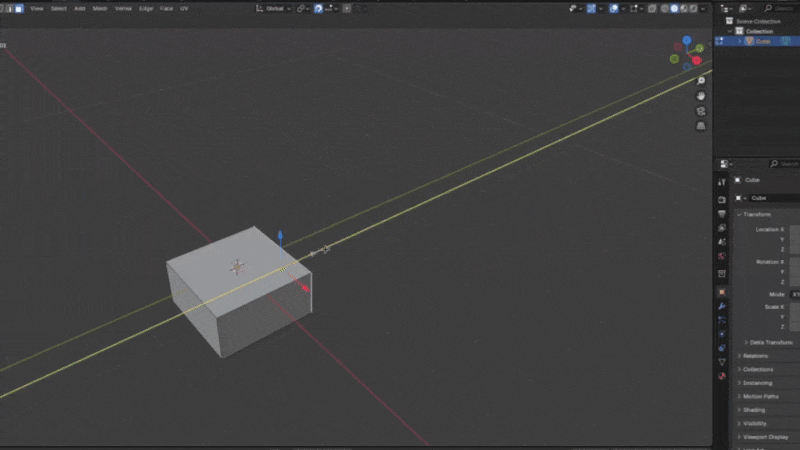
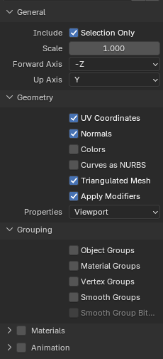

# How to create and test a level?
### Setup
- Download and install [Blender](https://www.blender.org/download/).
- Download the [level template file](CustomLevelTemplate.blend) from this repository. (.blend file)
### Build your level
- Design your level using the default blocks or create your own. Only the geometry will be read by the game. (It is recommended to enable grid snapping)
- To unlock the ice dimension, place `IceUnlocker` available in the blocks library where you want the orb to be. The Same apply for the bounce dimension with `BounceUnlocker` (Name is important).
- You can also place ferns and jumpers if needed (See example in the blender file)
- Place the finish line named `End` wherever you want. (Name is important)

#### Blender tips
Use grid snapping and closed shapes to build your level. If you are familiar with Trenchbroom, you can use the same approach.
Following this recommandations will make the whole process easier for you and it will prevent collisions and lighting issues.

  
### Export
- Select the objects you want to export.
- Export your level as `Wavefront (.obj)` with the following settings:

### Test
- Move your .obj file to your Documents folder in `Kinetic/MyMaps`. (Folders are automatically created by the game when clicking the custom level button in the level selection scene)
- In the game: Click the custom level button in the level selection scene. You should see your level name!
- Click your level to play it.
# How to publish your level?
Once you are satisfied with your level, let's get in touch on the discord server! (link in the main menu of the game)

Today, I have not the resources to build an integrated level editor that works with Steam workshop, so players can be fully autonomous in the levels creation.
As an alternative, I will review your level and integrate it in the game with the right textures, lighting and leaderbaord in a community levels section (With the author name of course).
Thanks for your understanding! Have fun!
